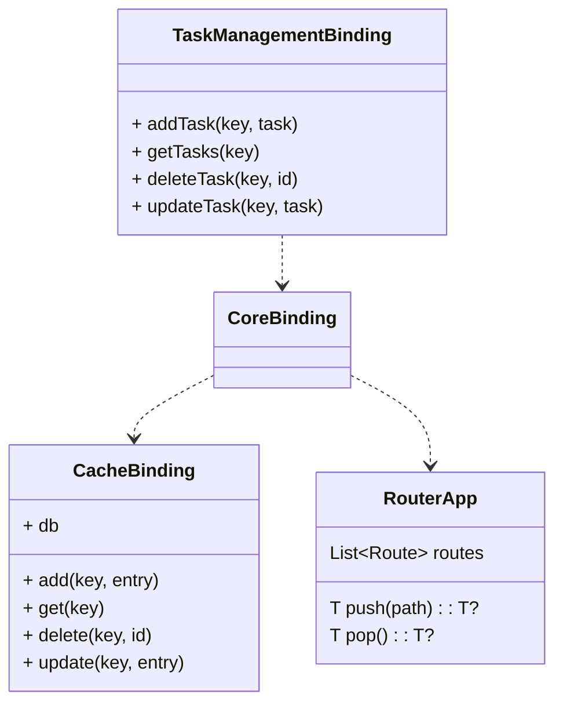
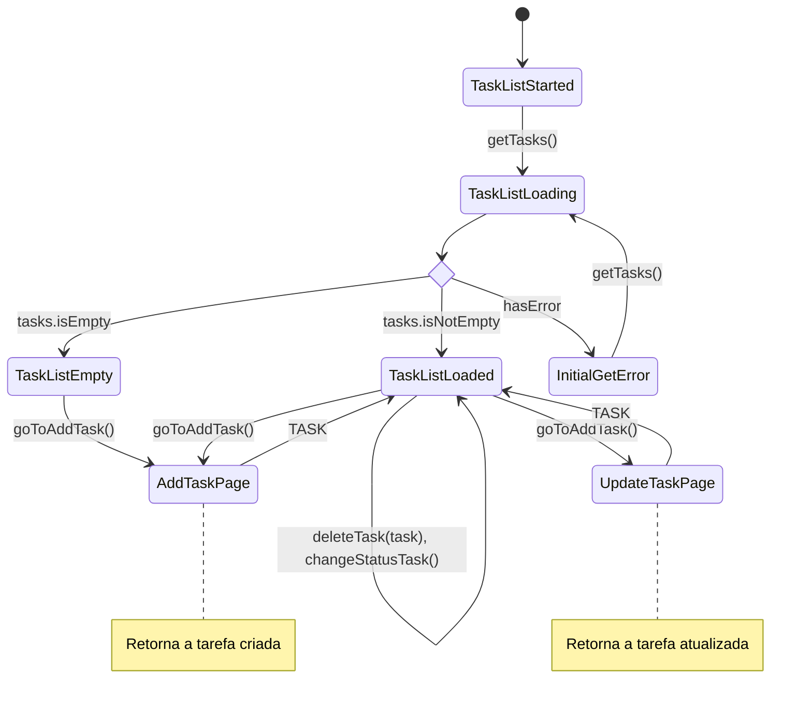
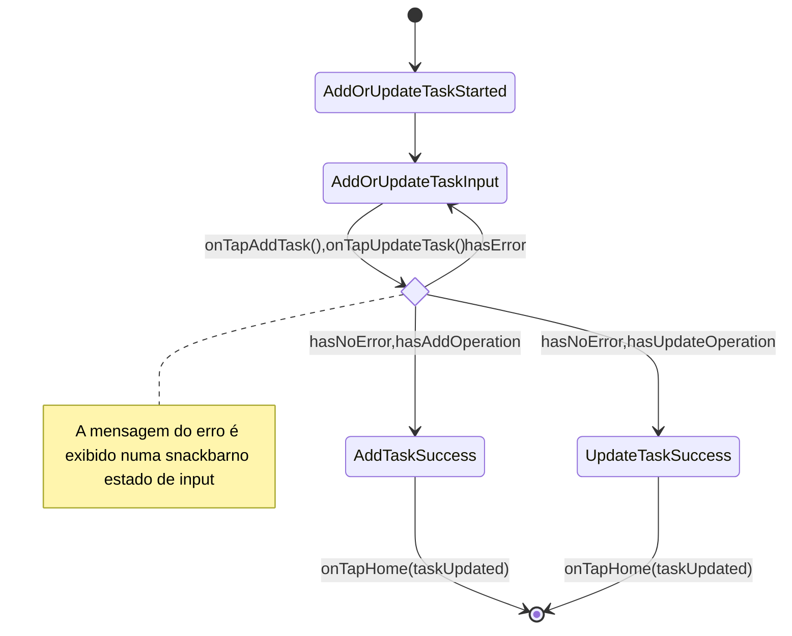

<a id="processo-seletivo-inicie"></a>
# 📄 Processo Seletivo Inicie
A "Lista de Tarefas" foi uma aplicação desenvolvida para o processo seletivo da Inicie que é capaz de gerenciar tarefas, consistidas por titulo, descrição, status (finalizada/pendente) e data de criação, persistidas localmente.
# Indice
- [Processo Seletivo Inicie](#processo-seletivo-inicie)
- [Arquitetura](#arquitetura)
  - [Camadas do Módulo](#camadas-do-módulo)
- [Módulos do App](#modulos-do-app)
  - [CoreBinding](#corebinding)
  - [CacheBinding](#cachebinding)
  - [RouterApp](#routerapp)
  - [TaskManagementBinding](#taskmanagementbinding)
- [Diagramação na aplicação](#diagramação-na-aplicação)
- [Pacotes Utilizados](#pacotes-utilizados)
  - [Injeção de dependências, gerenciamento de estado e Navegação (get)](#injecao-de-dependencias-gerenciamento-de-estado-e-navegacao-get)
  - [Programação funcional e fluxo seguro com Either (dartz)](#programacao-funcional-e-fluxo-seguro-com-either-dartz)
  - [Cache (shared_preferences)](#cache)
  - [Splash Screens e Ícone da Aplicação](#splash)
- [Páginas e Fluxos](#paginas-e-fluxos)
  - [Lista de tarefas](#lista-de-tarefas)
  - [Adicionar/Atualizar Tarefa](#adicionar-atualizar-tarefa)

<a id="arquitetura"></a>
# 🧱 Arquitetura
Este módulo segue uma arquitetura baseada em **Clean Architecture**, com adaptações para manter simplicidade e modularidade. A estrutura é replicada em todos os módulos do projeto, seguindo o padrão abaixo:
```
<module_name>/
├── domain/
│   ├── entities/
│   └── repository/
│   └── usecases/
├── infra/
│   ├── datasource/
│   └── repository/
├── external/
│   ├── converters/
│   └── datasource/
├── binding.dart
├── presentation/
│   └── pages/
│       ├── <screen_name>/
│       │   ├── <screen_name>_page.dart
│       │   ├── widgets/
│       │   └── controllers/
│       │       ├── <screen_name>_controller
│       │       └── <screen_name>_states
│       └── ...
```
<a id="camadas-do-módulo"></a>
## 🧱 Camadas do Módulo
### `domain/`
Contém as **entidades** e os **contratos de repositório**, totalmente isolados de dependências externas.

### `infra/`
Implementa os repositórios definidos no domínio e define a comunicação com fontes de dados (como APIs ou banco local).

### `external/`
Faz a ponte com o ambiente externo. Inclui as **implementações dos data sources** e os **conversores** entre `models` e `entities`.

### `presentation/`
Responsável pela interface do usuário e gerenciamento de estado. Consome diretamente os repositórios, **sem uso de use cases**, para manter o fluxo mais direto.

Essa organização promove separação de responsabilidades, reuso de código e facilita testes e manutenção em projetos de médio a grande porte.

<a id="modulos-do-app"></a>
# 🧱 Módulos do App

O aplicativo é dividido em módulos independentes, cada um com suas responsabilidades bem definidas e seguindo a arquitetura proposta:
<a id="corebinding"></a>

## 🛠️ CoreBinding
Módulo central da aplicação. É responsável por fornecer modulos, componentes grafico e demais itens globais utilizados em diferentes partes do app, como o cliente de cache e de roteamento, por exemplo.
<a id="cachebinding"></a>

## 🗄️ CacheBinding
Módulo que realiza as operações CRUD persistidas em um banco de dados local da aplicação.
<a id="routerapp"></a>

## 🧭 RouterApp
Módulo que define e realiza o roteamento da aplicação.
<a id="taskmanagementbinding"></a>

## ✅ TaskManagementBinding
Módulo que define as operações CRUD das tarefas além de gerenciar as suas paginas.
<a id="diagramação-na-aplicação"></a>

# 🗂️ Diagramação na aplicação


<a id="pacotes-utilizados"></a>
# 📦 Pacotes utilizados

Estes são os principais pacotes usados em todo o projeto para dar suporte à arquitetura, navegação, gerenciamento de estado e programação funcional. Cada um foi escolhido para promover código limpo, escalabilidade e facilidade de manutenção.

<a id="injecao-de-dependencias-gerenciamento-de-estado-e-navegacao-get"></a>
## 📦 Injeção de dependências, gerenciamento de estado e Navegação (get)

O projeto utiliza o framework Get para lidar de forma unificada com injeção de dependências, gerenciamento de estado e navegação. A injeção de dependências é simplificada pelo mecanismo de bindings do Get, que garante a criação e disponibilização dos controladores sempre que necessário. Para o gerenciamento de estados, foi adotado o padrão baseado no StateMixin dentro dos GetControllers, permitindo definir de forma explícita os diferentes estados de uma página e reagir a mudanças de maneira clara e previsível. Já a navegação é tratada pelo sistema de rotas do Get, que oferece transições consistentes e flexíveis entre telas, mantendo o fluxo da aplicação organizado e fácil de manter.

<a id="programacao-funcional-e-fluxo-seguro-com-either-dartz"></a>
## 📄 Programação funcional e fluxo seguro com Either (dartz)

Utilizamos a biblioteca dartz para aplicar conceitos de programação funcional, com destaque para a classe Either. Ela representa falhas e sucessos de forma segura e explícita, evitando exceções e assegurando um tratamento de erros adequado, o que torna o código mais limpo, previsível e fácil de testar.


<a id="cache"></a>
## 📄 Cache (shared_preferences)
O projeto faz uso do pacote shared_preferences para implementar o cache local. Esse recurso permite armazenar pares chave-valor de forma persistente no dispositivo, garantindo que informações importantes, como preferências do usuário e estados simples da aplicação, sejam recuperadas rapidamente mesmo após o fechamento ou reinício do app. O uso do shared_preferences proporciona uma solução leve e eficiente para persistência de dados sem a necessidade de um SGBD completo.

<a id="splash"></a>
## ⚡🎨 Splash Screens e Ícone da Aplicação

Tanto para a configuração das telas de splash quanto para a definição do ícone da aplicação, o projeto faz uso de dependências específicas que automatizam esses processos. Para as splash screens, foi adotado o pacote flutter_native_splash, adicionado como dependência de desenvolvimento, que gera o código nativo necessário e garante consistência visual entre as plataformas. Já para o ícone da aplicação, foi utilizado o flutter_launcher_icons, também como dependência de desenvolvimento, permitindo a criação automática de ícones em diferentes resoluções e formatos exigidos por Android e iOS.

<a id="paginas-e-fluxos"></a>
# 📄 Paginas e Fluxos
As seções abaixo descrevem as páginas existentes na aplicação como também seus respectivos fluxos de estados.

<a id="lista-de-tarefas"></a>
## ✅ Lista de tarefas
A lista de tarefas permite consultar os registros persistidos aplicando filtros específicos. Também oferece a possibilidade de excluir tarefas existentes e de acessar as páginas de adição e atualização de tarefas.




<a id="adicionar-tarefa"></a>
## 📄 Adicionar/Atualizar Tarefa
Página responsavel por adicionar e atualizar uma tarefa em nosso banco de dados.




